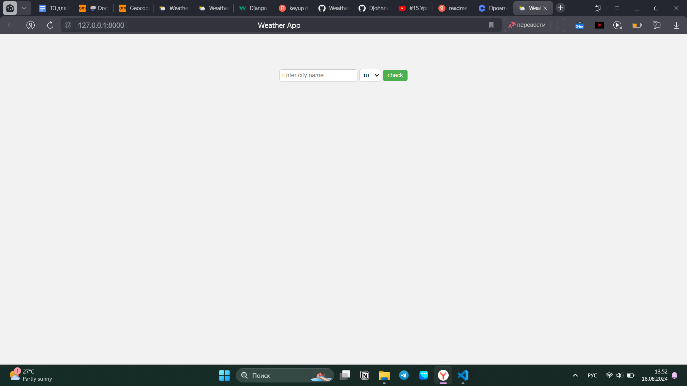
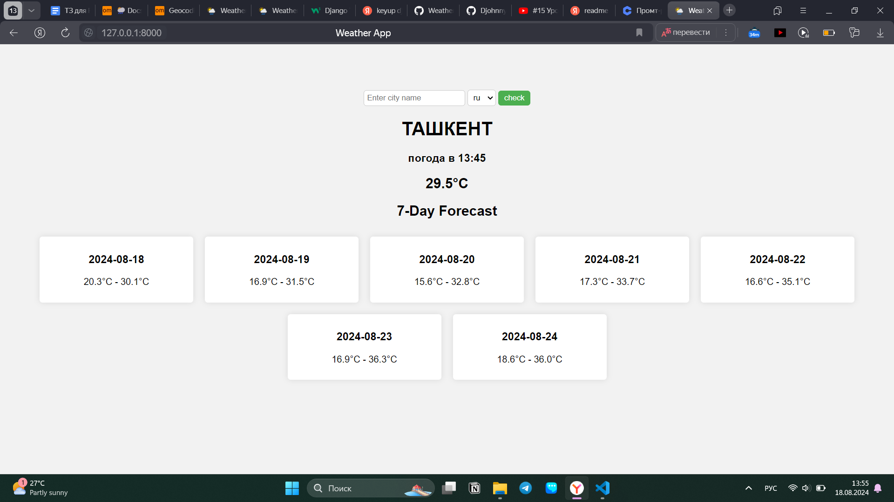

### Как скачать репозиторий
1. Скопировать http или ssh ссылку
2. Выполнить команду (git clone "сслыка")
### Как запустить weather_app
1. Открыт скачанную папку открыт в терминале
2. Активировать виртуальную среду python (venv/scripts/activate)
3. Перейти в папку weather_project (cd weather_project)
4. Запуск сервера (python manage.py runserver)
5. Перейти на http://127.0.0.1:8000/

### Результат

